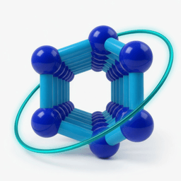

# luadseams (`dseams`)

<p align="center">
  
</p>

[](https://builtwithnix.org)

Lua and Fennel library for the [d-SEAMS](https://dseams.info) C++ engine
([`seams-core`](https://github.com/d-SEAMS/seams-core)).

This repository is a **library**. `require("dseams")` in Lua,
`(require :dseams)` in Fennel. The engine CLI is `seams` in
`seams-core`. Python is [`pydseams`](https://github.com/d-SEAMS/PydSEAMSlib).
Neighbour search is [`linkcell`](https://github.com/d-SEAMS/linkcell).

```lua
local dseams = require("dseams")
local cloud = dseams.read("water.lammpstrj")
print(dseams.chill_plus(cloud, {cutoff = 3.5}))
```

```fennel
(local dseams (require :dseams))
(local cloud (dseams.read "water.lammpstrj"))
(print (dseams.chill_plus cloud {:cutoff 3.5}))
```

`dseams.core` is the compiled registrations. Helpers stay in Lua, like
`pydseams` helpers stay in Python.

Build:

```bash
meson setup bbdir --wrap-mode=nofallback
meson compile -C bbdir
LUA_PATH="$PWD/lua/?.lua;;" LUA_CPATH="$PWD/bbdir/?.so;;" \
  lua example_lua/library/read.lua
```

Nix flake (meson, `require("dseams")`):

```bash
nix build
nix develop
lua example_lua/library/read.lua
```

`require("yoda")` still resolves to `dseams`.

Docs: `docs/orgmode/` (ox-rst) and `docs/source/` (Shibuya).

# License

[MIT](LICENSE). Fennel is `src/include/external/fennel/LICENSE-fennel`.
sol2 is `src/include/external/sol/LICENSE.txt`.
